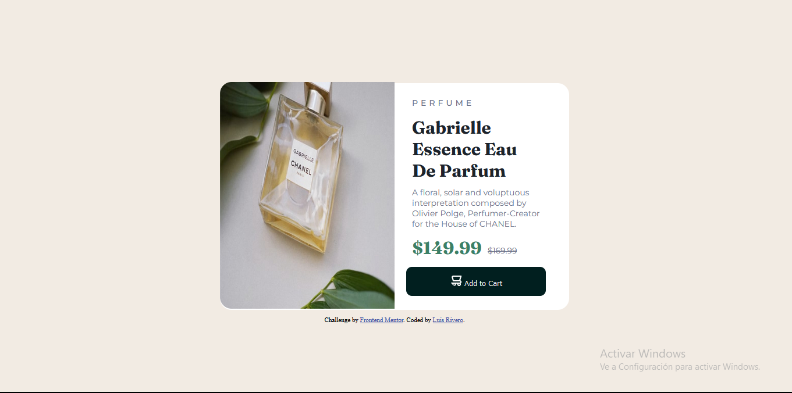

# Frontend Mentor - Product preview card component solution

This is a solution to the [Product preview card component challenge on Frontend Mentor](https://www.frontendmentor.io/challenges/product-preview-card-component-GO7UmttRfa). Frontend Mentor challenges help you improve your coding skills by building realistic projects. 

## Table of contents

- [Overview](#overview)
  - [The challenge](#the-challenge)
  - [Screenshot](#screenshot)
  - [Links](#links)
- [My process](#my-process)
  - [Built with](#built-with)
  - [What I learned](#what-i-learned)
  - [Continued development](#continued-development)
  
- [Author](#author)


## Overview

### The challenge

Users should be able to:

- View the optimal layout depending on their device's screen size
- See hover and focus states for interactive elements

### Screenshot





### Links

- Solution URL: [](https://github.com/LJRiveroPastrana/product-card-FrontendMentor)
- Live Site URL: [](https://ljriveropastrana.github.io/product-card-FrontendMentor/)

## My process

### Built with

- Semantic HTML5 markup
- CSS custom properties
- Flexbox
- Mobile-first workflow


### What I learned

To use @media, see below:

```css
@media only screen and (min-width: 376px) and (max-width: 1440px){
}
```


### Continued development

-Flexbox
-Grid
-JavaScript


## Author

- Frontend Mentor - [@LJRiveroPastrana](https://www.frontendmentor.io/profile/LJRiveroPastrana)
- Twitter - [@luisj_riverop](https://www.twitter.com/luisj_riverop)


